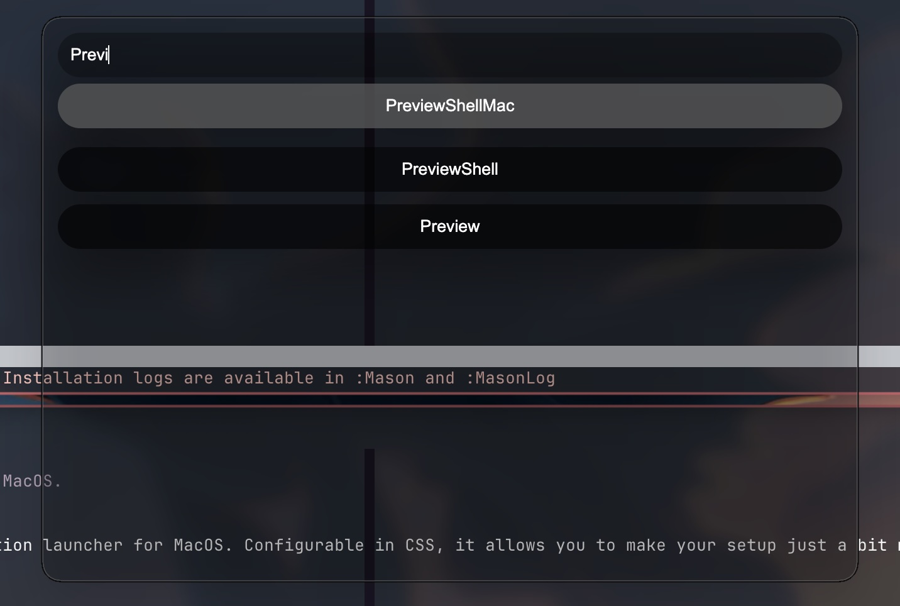

# Crooked Launcher
## A Customizable Application Launcher for MacOS.



# About
Crooked Launcher is a customizable application launcher for MacOS. Configurable in CSS, it allows you to make your setup just a bit more your style.

# Install

Run the following:
```
git clone https://github.com/Ethan-Heimer/Crooked-Launcher && cd Crooked-Launcher
npm i
```
# Use
To lanunch CrookedLauncher, run `npm start`. This will start the launcher. **Starting Crooked Launcher depends on your system and your configuration.**
You might need to try a few things to create a key bind to launch it automatically with somthing like aerospace or yabai. I'm gonna work on making this better in the future.

# Config

Crooked Launcher looks for a CSS file in `~/.config/crookedlauncher/` named `styles.css`. There, the following selectors can be used to customize the launcher:

| Selector    | Description                                                        |
| ----------- | ------------------------------------------------------------------ |
| body        | The main window of the launcher.                                   |
| #search     | The section that holds the search form and search field.           |
| #input-form | The form that holds the search bar.                                |
| #output     | The container that holds the results returned by your search term. |
| button      | The application returned by the search term.                       |
| .selected   | The currently selected application.                                |

**There is no limits as to what css you can use!**

Here is a starting config you can use!

```css
body{
    background-color: #00000000;
}


#search{
    animation-name: Popin;
    animation-duration: .25s;
    animation-timing-function: ease-in-out;
}

#input-form{
    display: flex;
    flex-direction: column;

    width: 100%;
}

#input{
    border: none;
    border-radius: 100px;

    margin: 5px;
    padding: 10px;

    background-color: #00000055;
    color: white
}

#output{
    display: flex;
    flex-direction: column;
}

button{
    padding: 10px;
    border: none;
    margin: 5px;
    border-radius: 100px;

    animation-name: Popin;
    animation-duration: .25s;
    animation-timing-function: ease-in-out;

    transition: .1s;

    background-color: #000000aa;
    color: white
}

button.selected{
    transform: translateY(-5px) Scale(1);

    background-color: #555555cc;
}

textarea:focus, input:focus{
    outline: none;
}

@keyframes Popin{
  0%   {transform: scale(0, 0);}
  80%   {transform: scale(1.05, 1.05);}
  100%  {transform: scale(1, 1);}
}

@keyframes PopinButton{
  0%   {transform: scale(0, 0);}
  80%   {transform: scale(1, 1);}
  100%  {transform: scale(.95, .95);}
}
```

# Disclosure
Listen, this uses Electron to render html and css as a standalone app. This isn't the fastest thing for what it's job is, theres other tools for that. This is just to make your
setup look just a bit nicer at the cost of performance and your ram. Also, I made this in less than a day out of boredem. Generative AI was not used to develop this project :).
